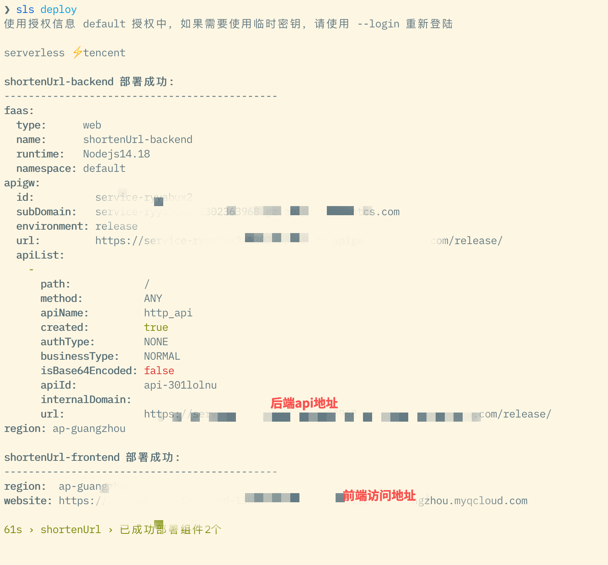
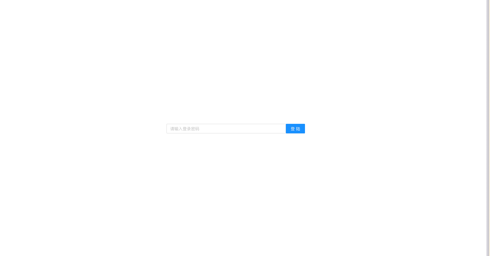
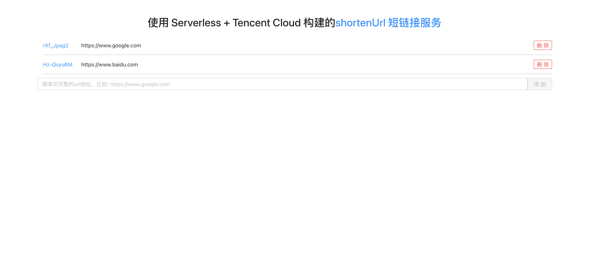
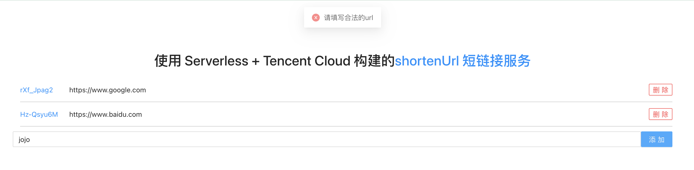

## 基于 Serverless CLI 和腾讯云的 shortenUrl 短链接应用

- [x] **0配置**: 可以直接使用默认配置完成整个项目的部署
- [x] **一键部署**: 只需要准备必要的前置条件，即可在根目录一条命令完成所有服务部署

### 前置条件

1. `Node.js` >= 12
2. [安装](https://cn.serverless.com/framework/docs-getting-started) `serverless` 命令行工具
3. [注册](https://cloud.tencent.com/register)腾讯云账号并[开通](https://cloud.tencent.com/document/product/1154/43006)权限
4. 开通[腾讯云 Redis 数据库](https://cloud.tencent.com/document/product/239/30821)

### 项目架构

此 **shortenUrl** 项目采取前后端分离的架构，前端提供页面 UI 展示和功能操作， 后端提供 API 和数据库操作. 项目提供了:

1. 密码登陆, 只有登陆成功才可以进行 新增 url 以及删除操作，防止非权限人员误操作
2. 新增 url
3. 删除 url
4. url 地址校验

根目录`serverless.yml`定义了`app, stage` 字段，因为需要确保模版下的组件使用相同的`app, stage` 字段，用户可自行修改需要的值

#### VPC 配置结构

`vpc` 目录下是帮助用户执行创建 **db** 和 **backend** 所需要的网络环境, 所创建的**vpc**和**subnet**提供给**db**和**backend**使用，用户可以自行修改，但是如果继续给**db, backend** 使用的话，**必须保证地域配置的正确性**, 比如**postgresql** 仅支持 `北京三区，广州二区，上海二区`, 那么`vpc/serverless.yml` 就必须选择这三个地域之一。

#### 数据库结构

`db` 目录下是使用[tencent-postgresql](https://github.com/serverless-components/tencent-postgresql) 组件来执行对 postgresql 数据库的创建

部署成功之后，可以在腾讯云云数据库中的*PostgreSQL* 中看到对应实例.

**注意事项**:

1. 当前 _PGSQL for Serverless_ 仅支持 `北京三区，广州二区，上海二区` 三个地域的创建和部署:
    1. 在填写 `backend/serverless.yml` 中的地域可用区时需要注意填写为正确的地域
    2. `backend/serverless.yml` 中我们所使用的`vpc`配置 是在*vpc*目录下生成的结果: `${output:${stage}:${app}:shortenUrl-vpc.vpcId}`，所以需要确保`vpc`目录实例下的地域选择为正确的地域
2. PostgreSQL 组件当前暂不支持 CLI 扫描二维码登录，因此您需要配置[全局认证信息](https://cn.serverless.com/framework/docs-commands-credentials)或者在根目录`.env` 文件中填写信息来配置持久的环境变量/秘钥信息, [详情](https://github.com/serverless-components/tencent-postgresql#4-%E8%B4%A6%E5%8F%B7%E9%85%8D%E7%BD%AE)

```bash
# .env
TENCENT_SECRET_ID=123
TENCENT_SECRET_KEY=123
```

#### 后端结构

`backend` 文件夹中即为后端项目目录:

-   使用上面配置的的**db**实例的输出作为数据库的 url 来实现对应`shorten key` 数据存储
-   使用[tencent-http](https://github.com/serverless-components/tencent-http) + [koajs](https://koajs.com/) 作为技术选型

需要准备:

-   `.env` 中添加`authPass` 作为登陆密码

```bash
authPass=xxxx
```

**注意事项**:

1. `backend/serverless.yml`中使用了`db`项目提供的数据库链接: `${output:${stage}:${app}:shortenUrl-db.private.connectionString}`, 其中`shortenUrl-db`是数据库实例项目的名称，如果`db/serverless.yml` 中的*name* 被修改，请记得把这里的参数也相应修改。
2. `backend/serverless.yml` 中我们所使用的`vpc`配置 是在*vpc*目录下生成的结果: `${output:${stage}:${app}:shortenUrl-vpc.vpcId}`，所以需要确保`vpc`目录实例下的地域选择为正确的地域

后端项目成功部署后，会在腾讯云 scf 中自动部署一个名为`shortenUrl-backend`的项目，用户可在其中查看日志或者函数配置

#### 前端结构

`frontend` 文件夹中即为前端项目目录:

-   使用[tencent-website](https://github.com/serverless-components/tencent-website) 作为项目框架
-   使用 `React` + `Ant.design` + `ky` 作为技术选型

`frontend/serverless.yml` 中使用了`backend` 项目提供的后端 ApiUrl`${output:${stage}:${app}:shortenUrl-backend.apigw.url}`, 其中`shortenUrl-backend` 是后端项目的名称，如果后端项目的名称被修改，前端`yml`中此处的值需要对应修改。 可以做到无缝部署，不需要分别部署.
前端项目部署之后会将静态资源存在 COS 的`shorten-url-frontend`bucket 中，可以自行在`serverless.yml`中修改

#### 本地开发

1. `sls deploy` 之后，会在用户的`shorten-url-frontend` bucket 生成一个 `env.js` 文件，需要将其下载到`frontend/public` 文件夹中。 之所以在本地开发的时候需要这个文件是因为这个文件会把后端 API 的地址自动注入`window.env` 中，供前端 API 访问使用， 所以本地开发的时候需要手动下载。 线上项目会自动获取。
2. 进入`frontend`文件夹下，执行`npm install` 安装依赖
3. 执行 `npm start` 本地运行项目

### 部署流程

-   根目录执行 `sls deploy`, 命令行会自动分别部署`vpc, db, backend, frontend` 项目
-   打开 `shortenUrl-frontend` 输出的 `website` 地址即可看到项目前端，进行操作

### 效果截图

-   项目命令行部署: 
-   登陆界面: 
-   主界面: 
-   url 校验: 
